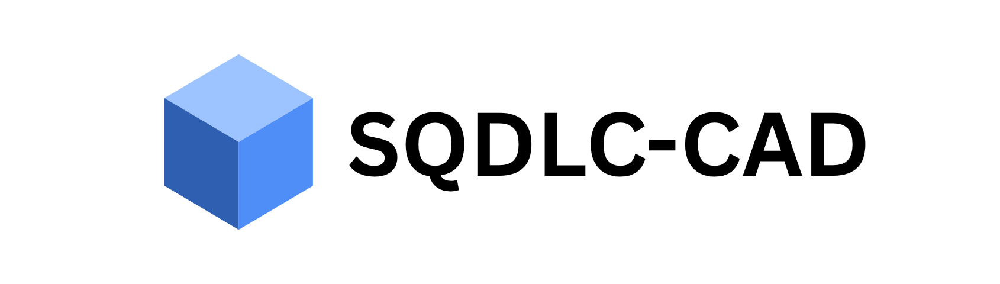

# SQDLC-CAD

A free, browser-based 3D modeling / CAD tool. No sign-up, no account, no server —
everything runs and is stored entirely on your machine, in your browser.

Modeling works Tinkercad-style: add primitive solids, mark any shape as a **Hole**,
then select multiple shapes and **Group** to combine them (solids are unioned, holes
are subtracted). Ungroup at any time to edit the pieces individually again.

## Running it locally

Requires [Node.js](https://nodejs.org/) (18+).

```bash
npm install
npm run dev
```

Then open the printed `http://localhost:5173` URL — it opens on a landing page; click
**Launch App** (or go straight to `http://localhost:5173/#/app`) to get to the editor.
That's it — no accounts, no network calls, no external services. Everything (rendering,
geometry, boolean operations, file export) happens in your browser.

To produce a static build you can host or open directly:

```bash
npm run build   # outputs to dist/
npm run preview # serve the production build locally to sanity-check it
```

## Features

- Primitives: box, sphere, cylinder, cone, torus, wedge.
- Move / rotate / scale via on-screen gizmo, direct click-and-drag on the shape body, or
  precise numeric fields. Multi-select and transform several shapes together as one rigid
  group, pivoting around their shared center.
- **Precision dragging**: while dragging a shape, press `X`/`Y`/`Z` to lock movement to one
  axis, then type an exact distance and hit `Enter` to snap to it precisely — `Escape`
  clears a typed value, or cancels the whole drag if nothing's been typed yet.
- **Snapping**: shapes snap to nearby shapes' edges/centers, and to the grid, while dragging
  (toggle with the Snap checkbox).
- **Arrays**: linear (evenly spaced along an axis) and circular (evenly spaced around a
  center point) duplication patterns.
- Solid/Hole toggle + Group/Ungroup for boolean union & subtract (via `three-bvh-csg`).
- **Import**: `.stl`, `.obj`, `.3mf`, and `.step`/`.stp`/`.iges`/`.igs` (via a bundled
  WebAssembly CAD kernel — see below). Imported models come in as a static mesh you can
  move/scale/group like any other shape, though STEP/IGES imports aren't parametrically
  editable (no sketch/feature history survives the conversion).
- Export the whole scene as `.stl` or `.obj`.
- Object tree, duplicate, delete, full undo/redo.
- Responsive layout: on phone/tablet widths the object list and inspector become slide-in
  drawers (toggle via the ☰ and ⚙ buttons), the file-ops group collapses into a **File** dropdown,
  and the rest of the toolbar scrolls horizontally; touch drag/orbit/pinch-zoom work the same as
  mouse, touch targets are enlarged, and safe-area insets are respected on notched devices.
- A landing page (`#/`) with a **Launch App** link into the editor (`#/app`), plus a
  Privacy Policy (`#/privacy`) and Terms & Conditions (`#/terms`) — all client-side, hash-routed
  pages with no server dependency.
- Autosaves to your browser's local storage (IndexedDB) as you work — refreshing the
  page won't lose your model. You'll be prompted to restore it next time you open the app.
- Save/Open projects as `.json` files.

## Keyboard shortcuts

| Key | Action |
| --- | --- |
| `1` / `2` / `3` | Move / Rotate / Scale gizmo mode |
| `X` / `Y` / `Z` (while dragging) | Lock the drag to one axis |
| Type a number + `Enter` (while axis-locked) | Move by an exact distance |
| `Ctrl+G` / `Ctrl+Shift+G` | Group / Ungroup selection |
| `Ctrl+D` | Duplicate selection |
| `Delete` / `Backspace` | Delete selection |
| `Ctrl+Z` / `Ctrl+Shift+Z` | Undo / Redo |
| `Escape` | Clear selection, or cancel/clear an in-progress drag |
| Shift/Ctrl + click | Add to selection |

## Tech stack

Vite + React + TypeScript, `three.js` / `@react-three/fiber` / `@react-three/drei`
for rendering, `three-bvh-csg` for boolean solid geometry, `zustand` + `zundo` for
state and undo history, `idb-keyval` for local autosave, `opencascade.js` (OpenCASCADE
compiled to WebAssembly) for STEP/IGES import.

The OpenCASCADE WASM binary (~65MB) is lazy-loaded only the first time you actually import
a STEP/IGES file — it's not part of the initial app bundle/load.

## Known limitations

- Modeling is primitive + boolean based (Tinkercad-style), not a parametric
  sketch/extrude CAD system and not a vertex-level mesh editor. STEP/IGES import brings in
  geometry only (triangulated at import time), not the source file's parametric history.
- `npm run dev`'s Vite dev server has a known low-severity advisory
  ([GHSA-67mh-4wv8-2f99](https://github.com/advisories/GHSA-67mh-4wv8-2f99)) affecting
  local dev servers; it only applies while `npm run dev` is running and does not
  affect the production build.
